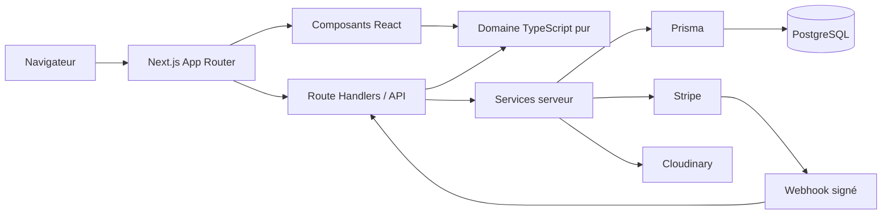
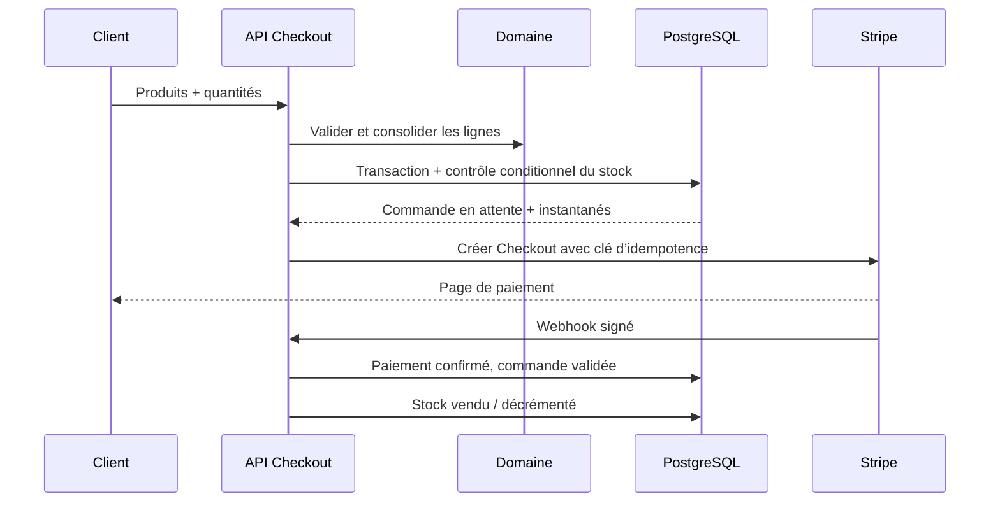

# Architecture technique — L’Inventaire

Ce document décrit l’architecture de référence du projet, les frontières entre couches et les invariants à préserver lors des évolutions.

Il s’agit de la cible de production. La vitrine, le domaine pur, les protections HTTP, la session de démonstration et Stripe Checkout sont opérationnels ; les dépôts Prisma des routes métier, l’authentification PostgreSQL, la transaction de commande, la déduplication durable du webhook et l’upload Cloudinary restent à raccorder.

## 1. Principes

- **Une source de vérité serveur** pour le stock, les commandes, les rôles et les paiements.
- **Une logique métier indépendante de React** afin de pouvoir la tester sans navigateur ni base.
- **Des données non fiables aux frontières** : toute entrée HTTP, CSV, formulaire ou webhook est validée avant usage.
- **Des montants exacts** : les calculs de domaine utilisent des centimes entiers ; Prisma conserve les prix avec un type décimal adapté.
- **Des objets uniques réellement uniques** : la quantité maximale est 1 et l’achat final est arbitré dans PostgreSQL.
- **Des intégrations optionnelles et fermées par défaut** : une configuration incomplète ne doit jamais activer un faux niveau de sécurité.

## 2. Vue d’ensemble



Le navigateur peut conserver un brouillon de panier et des favoris pour la fluidité. Ces données ne valent jamais confirmation de stock, de rôle ou de paiement.

## 3. Couches et règles de dépendance

### Présentation — `src/app` et `src/components`

Les routes App Router orchestrent le rendu, les métadonnées et les états de page. Les composants clients sont réservés aux interactions qui exigent l’état du navigateur : panier, favoris, filtres mobiles et formulaires interactifs.

La présentation peut dépendre des types et du domaine. Le domaine ne doit importer ni React, ni Next.js, ni Prisma.

### Domaine — `src/lib/domain`

| Module | Responsabilité |
| --- | --- |
| `catalog.ts` | normalisation, recherche, filtres combinables et tris stables |
| `cart.ts` | ajout, suppression, quantités, remises et totaux en centimes |
| `order.ts` | contrôle de stock, instantanés de lignes et préparation immuable d’une commande |
| `reservation.ts` | machine à états des demandes et libération à expiration |
| `validation.ts` | contrats de formulaires indépendants de l’interface |
| `authorization.ts` | décision et garde d’accès administrateur |

Les fonctions reçoivent toutes leurs dépendances en paramètres et renvoient un nouvel état. Elles sont déterministes, sans lecture de variable d’environnement ni accès réseau.

### Serveur — `src/lib/server` et `src/app/api`

Cette couche adapte HTTP aux règles métier :

- lecture JSON bornée et validation Zod stricte ;
- erreurs structurées et absence de cache sur les réponses sensibles ;
- contrôle d’origine pour les mutations initiées par le navigateur ;
- sessions JWT signées, cookies `HttpOnly`, `SameSite=Lax` et `Secure` en production ;
- contrôles de rôle au plus près de chaque route administrateur ;
- limitation de débit ;
- signature Stripe vérifiée sur le corps brut ;
- traduction des conflits de stock en réponses HTTP compréhensibles.

### Persistance — `prisma`

`schema.prisma` décrit les relations ; `prisma.config.ts` configure Prisma 7 et le seed `tsx prisma/seed.ts`. Le client généré dans `src/generated/prisma` est un artefact et ne doit pas être édité manuellement.

Les migrations sont la seule manière de modifier une base partagée. Le seed est idempotent et convient aux environnements locaux, de recette et à une initialisation contrôlée de production.

Le schéma et le seed existent, mais les routes HTTP de démonstration ne passent pas encore par des dépôts Prisma. Leur raccordement doit respecter les transactions et invariants décrits dans les sections suivantes.

## 4. Modèle de données

Les ensembles principaux sont :

- `User` et `Address` pour les comptes, rôles et coordonnées ;
- `Category` avec `parentId` pour une hiérarchie de profondeur variable ;
- `Collection`, `Product`, `ProductImage` et la liaison plusieurs-à-plusieurs `ProductCollection` ;
- `Favorite`, `Cart` et `CartItem` pour le parcours avant achat ;
- `Order` et `OrderItem` pour la vente et son historique immuable ;
- `Reservation` pour les demandes et échéances ;
- `ContactMessage`, `PromotionCode` et les contenus éditoriaux.

Les lignes de commande copient le nom, la référence, la quantité et le prix unitaire du produit. Une modification ou un archivage ultérieur du catalogue ne doit jamais réécrire l’historique d’une commande.

## 5. Flux catalogue

1. La page charge uniquement les produits publiés correspondant au contexte de route.
2. La recherche normalise casse, accents, apostrophes et ponctuation.
3. Tous les mots saisis doivent apparaître dans l’index textuel métier : titre, description, référence, catégorie, collection, date, lieu, fabricant, marque, modèle, éditeur, artiste ou thème.
4. Les filtres s’appliquent avec une logique `ET` entre familles et une logique `OU` au sein d’une sélection multiple.
5. Le tri est stable ; la pagination doit être appliquée après les filtres.

Le catalogue TypeScript sert la démonstration. En mode PostgreSQL, ces critères sont traduits en requêtes indexées et paginées, sans charger toute la table en mémoire.

## 6. Flux panier, commande et stock unique



La transaction doit verrouiller ou mettre à jour conditionnellement les lignes concernées. Un exemple d’intention SQL est :

```sql
UPDATE "Product"
SET quantity = quantity - 1
WHERE id = $1
  AND status = 'AVAILABLE'
  AND quantity >= 1;
```

Une mise à jour affectant zéro ligne est un conflit, pas un succès. Pour un objet unique, le passage à `SOLD` intervient quand la quantité atteint zéro. L’identifiant de session Stripe ou une clé métier possède une contrainte unique afin qu’un webhook rejoué ne crée pas une seconde commande.

## 7. Flux de réservation

```text
PENDING ──acceptée──> ACCEPTED ──échéance──> EXPIRED
   │                      │
   ├──refusée──> REJECTED └──annulée──────> CANCELLED
   └──annulée──> CANCELLED
```

- Une demande n’est possible que pour un produit `AVAILABLE`, en stock et réservable.
- L’acceptation place le produit en `RESERVED` et fixe `expiresAt`.
- Le refus d’une demande en attente ne change pas le produit.
- L’annulation ou l’expiration d’une réservation acceptée remet le produit à `AVAILABLE`, sauf si une autre opération légitime l’a déjà vendu.
- Une tâche planifiée doit traiter les échéances en production ; une simple vérification côté navigateur est insuffisante.

## 8. Authentification et autorisation

Le serveur signe des JWT HS256 avec `AUTH_SECRET`, un émetteur et une audience fixes. La durée est bornée entre 5 minutes et 7 jours. Le cookie de session est inaccessible à JavaScript.

Le mode de développement peut créer des utilisateurs à partir de hachages bcrypt fournis dans les variables `DEMO_*`. Il est explicitement désactivé en production. Sans secret configuré, une clé aléatoire éphémère est tolérée uniquement lorsque la démo est activée ; le redémarrage invalide alors les sessions.

La présence d’un bouton ou le masquage d’une page n’est pas une autorisation. Chaque route `/api/admin/*` vérifie une session valide et le rôle exact `ADMIN` côté serveur.

## 9. Stripe

`/api/checkout` n’active Stripe que si les trois éléments serveur sont cohérents : `STRIPE_SECRET_KEY`, `STRIPE_WEBHOOK_SECRET` et `NEXT_PUBLIC_SITE_URL`. Le prix et la disponibilité sont toujours relus côté serveur ; aucun montant envoyé par le navigateur n’est accepté comme référence.

`/api/stripe/webhook` :

1. lit le corps brut ;
2. vérifie la signature avec `STRIPE_WEBHOOK_SECRET` ;
3. identifie l’événement de manière idempotente ;
4. applique la transition de paiement/commande dans une transaction ;
5. répond rapidement en `2xx`, les traitements lents pouvant être délégués.

## 10. Cloudinary et images

En développement, les illustrations SVG sont générées par le composant `DemoArtwork`. En production, les secrets Cloudinary restent dans la couche serveur. La base stocke l’URL sécurisée et les métadonnées utiles, jamais le fichier binaire ni un secret de signature.

Les règles d’upload doivent vérifier le type réel, la taille, les dimensions, la quantité de fichiers et l’identité administrateur. Le texte alternatif et l’ordre d’affichage restent des données métier modifiables.

## 11. Sécurité

- validation stricte et taille maximale des corps HTTP ;
- échappement React par défaut et absence d’injection HTML arbitraire ;
- protection d’origine, cookies `SameSite` et méthodes HTTP dédiées ;
- hachage bcrypt des mots de passe, secret de session fort et rotation possible ;
- vérification du rôle côté serveur ;
- en-têtes `nosniff`, anti-framing, politique de référent et permissions minimales ;
- vérification cryptographique des webhooks ;
- clés d’idempotence et contraintes uniques ;
- messages publics non sensibles et journalisation serveur corrélée.

Le limiteur en mémoire convient à une instance locale. Un déploiement horizontal doit utiliser un stockage partagé tel que Redis ou Vercel KV.

## 12. Performance, accessibilité et SEO

- composants serveur par défaut et JavaScript client limité aux interactions ;
- images responsives, chargement différé et négociation AVIF/WebP ;
- pagination et index PostgreSQL sur les slugs, références, statuts, dates et clés étrangères ;
- métadonnées par page, URLs lisibles, fil d’Ariane, sitemap, robots et données structurées ;
- titres hiérarchiques, labels explicites, focus visible, navigation clavier et contrastes suffisants ;
- cache public uniquement pour les contenus non personnalisés, jamais pour session, panier serveur ou administration.

## 13. Stratégie de tests

Les tests unitaires sous `src/__tests__` couvrent les invariants du domaine :

- recherche accent-insensible et filtres combinés ;
- ajout, retrait, quantités et calculs du panier ;
- instantanés de commande et second achat refusé ;
- acceptation, refus, annulation et expiration des réservations ;
- validation des entrées et contraintes d’objet unique ;
- session absente, expirée, rôle client et rôle administrateur.

Les compléments recommandés pour une production sont des tests d’intégration Prisma sur une base isolée, des tests de contrats des routes HTTP, des événements Stripe signés en environnement de test et quelques parcours navigateur : recherche → fiche → panier → paiement, demande de réservation, connexion administrateur → modification produit.

## 14. Décisions d’exploitation

- `prisma migrate dev` est réservé au développement ; `prisma migrate deploy` applique l’historique en production.
- Les variables `SEED_ADMIN_*` servent à l’initialisation puis doivent être retirées, surtout le mot de passe.
- Le webhook Stripe est configuré après fixation de l’URL canonique.
- Les migrations ne sont lancées qu’une fois par version, pas en parallèle dans chaque instance Vercel.
- Les sauvegardes PostgreSQL, la restauration, la rétention des messages et les suppressions RGPD font partie de l’exploitation, pas du code de l’interface.
